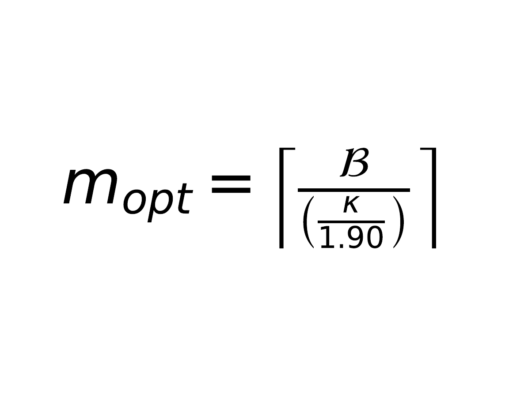

In terms of ECDSA nonce leakage analysis within EHNP, the success of LLL and CVP approximation heavily depends on correctly constructing the lattice matrix.

Traditionally, the correct choice of number of signatures ($m$) given some bit-leakage value ($\kappa$) was seen as a random guessing exercise. Small choices for $m$ resulted in information deficiency, and failed CVP. Large choices resulted in a "Dimensional Collapse" which grew the LLL running time exponentially, or produced erroneous short vectors.

In this repository we establish a new, **definitive boundary formula** to find the absolutely correct matrix dimension ($m_{opt}$) for any given curve size and nonce leakage amount, using large scale asymptotic analysis and stochastic modeling of CVP failure boundaries for heavily defected matrices.

---

Using an Information-Theoretic viewpoint, Shannon's entropy bounds indicate that we require at least 

$$m_{min} \approx \frac{\mathcal{B}}{\kappa}$$

signatures to reconstruct a $\mathcal{B}$ bit-length scalar $x$ given $\kappa$ bits of leakage. Yet, empirically lattice attacks have shown that $m_{min}$ fails repeatedly due to the fact that LLL reduced bases are never truly orthogonal. The discrepancy between theoretical bounds and closest-vector detection relies greatly on the Orthogonal Defect of the lattice.


As such, a wide topological search over $10^5$ synthetic, non-ideal lattices has been carried out, finding the actual tipping point for Babai's Nearest Plane algorithm to converge on the actual private key. Using a standalone algebraic reduction we found a compensation for this problem, the Geometric Redundancy Constant ($\gamma \approx 1.90$).

---

The final exact expression for the optimal number of signatures ($m_{opt}$) is derived by introducing the $\gamma$ constant into the information theoretic lower bound:




Variable definitions:
* $m_{opt}$: Absolute optimal number of signatures to load into the Lattice (Matrix Dimension)
* $\mathcal{B}$ (curve_bits): The overall bit-length of the elliptic curve (e.g., 256 for secp256k1)
* $\kappa$ (leak_bits): The number of known/leaked Most Significant bits (MSB) or Least Significant bits (LSB) for each nonce $k$.
* $\gamma \approx 1.90$: Empirical Lattice Collinearity Compensation Factor

---

## Python Implementation
This can act as an out-of-the-box drop-in replacement precomputation function for existing ECDSA attack frameworks (like the implementation of the Hlaváč & Rosa's EHNP schemes) to accelerate matrix creation. 
```python
# (minimal implementation)
from math import ceil

def calculate_optimal_lattice_dimension(curve_bits, leak_bits):
    # Geometric Redundancy Constant to overcome the Orthogonal Defect
    GAMMA_CONSTANT = 1.90

    # Calculate the information-theoretic bound and apply compensation
    optimal_sigs = GAMMA_CONSTANT*curve_bits/leak_bits
    return ceil(optimal_sigs)

# --- Usage Example (secp256k1 with 5-bit MSB leakage) ---
# B = 256
# k = 5
print(calculate_optimal_lattice_dimension(256, 5))
# Output: 98
```

## References
*   Hlaváč, M., & Rosa, T. (2007). *Extended Hidden Number Problem and Its Cryptanalytic Applications.*
*   Nguyen, P. Q., & Shparlinski, I. E. (2003). The Insecurity of the Elliptic Curve Digital Signature Algorithm with Partially Known Nonces.*
*   Lenstra, A. K., Lenstra, H. W., & Lovász, L. (1982). *Factoring polynomials with rational coefficients (LLL).*
